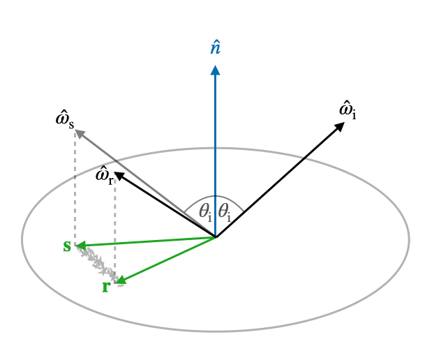

urdf - A Unitary BRDF model for surfaces with Gaussian deviations
======

This code implements the unitary BRDF model in the paper "A Model for Geometric Reflections from Gaussian Surfaces extended to Grazing Angles" ([pdf - open access](./paper/gauss_reflections.pdf)).

This is an idealised physically-based rendering model where every incoming ray is reflected somewhere (in the upper hemisphere), corresponding to a random walk initialised with the specular direction. The result is a model in-between that of an idealised flat reflector, and Lambertian scattering. 



The model is parameterised by a single roughness value $\sigma^2$ which matches the occlusion and self-shadowing in the linear regime to the mean-square surface gradients (for each dimension) of a Gaussian heightfield $h$.

```math
\mathbb{E}\left[(\partial_i h)(\partial_j h)\right] = \sigma^2 \delta_{ij}
```
The BRDF can be written as a series in Zernike polynomials,
```math
f^{\rm iso}_\sigma ({\bf r} , {\bf s} ) = \sum_{n=0}^\infty \; \sum_{m=-n}^n \frac{2n+2}{\pi \epsilon_m} Z^m_n( {\bf r} ) Z^m_n({\bf s} ) e^{-2 \sigma^2 (n(n+2) - m^2)} ,
```
where ***r*** and ***s*** are the reflected and specular directions, but in practice this is summed as the (faster converging) series
```math
f^{\rm iso}_\sigma ({\bf r}, {\bf s} ) =\frac{1}{\pi} \sum_{n=0}^\infty e^{-8\sigma^2 n(n+1)} {\rm Re} \left[ \Omega_n\left(1-2r^2, \right. \left. 1-2s^2, rse^{i(\phi_{\rm s} - \phi_{\rm r})-4\sigma^2(2n+1)} \right) \right],
```
where the $\Omega_n(\mu,\nu,z)$ can be written in terms of Jacobi polynomials (see paper link above).

### Running the source code

The source code is provided as a C file along with an example python binding in `lib.py`.

From the cloned repository on a unix-like system you could try
```bash
make
```
and run the tests,
```bash
make test
```

## Interface

Both the C and python interfaces are there to calculate the isotropic BRDF $f({\bf r}, {\bf s}; \sigma, k)$, where `k>=0` indicates the maximum number of terms to include.

### Python example.py

```python
import numpy as np
import pylab as pl
from urdf.lib import brdf_iso_jacobi

N=300

# NxN grid of projected r
yr, xr = (np.mgrid[:N,:N] + 0.5) * (2 / (N-1)) - 1 
# Projected r only within |r| <= 1
idx = np.flatnonzero((yr*yr+xr*xr).ravel()<1.0)
xr = xr.ravel()[idx]
yr = yr.ravel()[idx]

# Specular direction
theta = 30 * np.pi/180.0 # Angle from normal
xs = np.sin(theta)
ys = 0

# Gradient of surface deviations
sigma = 0.2

# BRDF
f = np.zeros(N*N)
f[idx] = brdf_iso_jacobi(xr,yr,xs,ys, sigma, kmax=10)
f = np.reshape(f, (N,N))

# Plot
pl.imshow(f)
pl.show()

```
which should produce something like


All this is equivalent to running `python examples\example.py`

