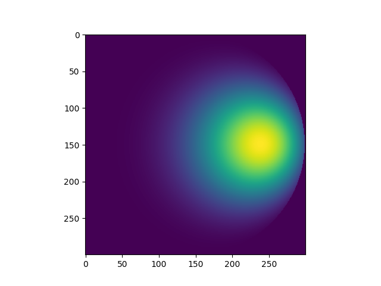

urdf
======

## Unitary BRDF calculations

This code is based on the paper "A Model for Geometric Reflections from Gaussian Surfaces extended to Grazing Angles" by Peter Creasey [arxiv](https://TODO).

### Running the source code

The source code is provided as a C file along with an example python binding in `lib.py`.

From the cloned repository on a unix-like system you could try
```bash
make
```
and run the tests,
```bash
make test
```

## Interface

Both the C and python interfaces are there to calculate the isotropic BRDF $f({\bf r}, {\bf s}; \sigma, k)$, where **r** and **s** are the reflected and specular directions projected onto the surface, $\sigma$ is standard deviation of the surface gradients, and `k>=0` indicates the maximum number of terms to include.

### Python example.py

```python
import numpy as np
import pylab as pl
from urdf.lib import brdf_iso_jacobi

N=300

# NxN grid of projected r
yr, xr = (np.mgrid[:N,:N] + 0.5) * (2 / (N-1)) - 1 
# Projected r only within |r| <= 1
idx = np.flatnonzero((yr*yr+xr*xr).ravel()<1.0)
xr = xr.ravel()[idx]
yr = yr.ravel()[idx]

# Specular direction
theta = 30 * np.pi/180.0 # Angle from normal
xs = np.sin(theta)
ys = 0

# Gradient of surface deviations
sigma = 0.2

# BRDF
f = np.zeros(N*N)
f[idx] = brdf_iso_jacobi(xr,yr,xs,ys, sigma, kmax=10)
f = np.reshape(f, (N,N))

# Plot
pl.imshow(f)
pl.show()

```
which should produce something like


All this is equivalent to running `python examples\example.py`

